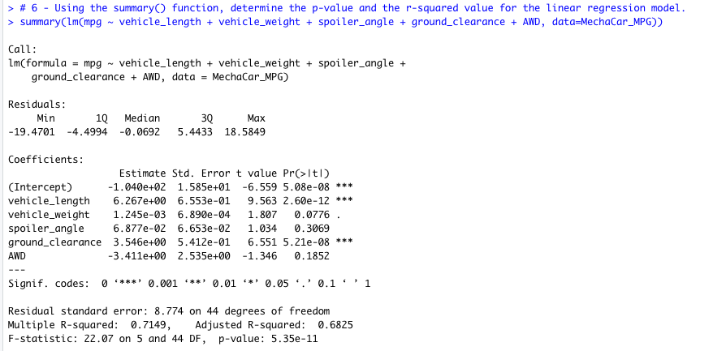
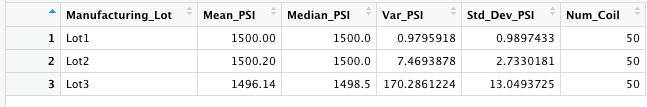
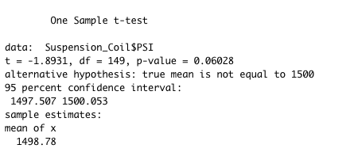
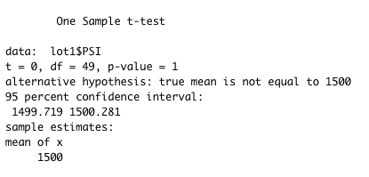
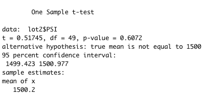
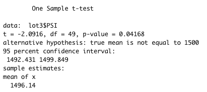

# MechaCar_Statistical_Analysis

 ## Linear Regression to Predict MPG
 
* Vechicle length and ground clearance provided a non-random amount of variance to the mpg values in the dataset due to there P values being lower than .05?
 
* Is the slope of the linear model is much smaller than the assumed significance level of 0.05% which indicates that the slope of this linear model is not zero.

* This model is not effectivve at predicting mpg as it has a squared value of .7149

## Summary Statistics on Suspension Coils

* The design specifications for the MechaCar suspension coils dictate that the variance of the suspension coils must not exceed 100 pounds per square inch. Does the current manufacturing data meet this design specification for all manufacturing lots in total and each lot individually? Why or why not?

When we look at the total summary, the variance of the coils is 62.29 Pounds per Square inch, which is within the 100 PSI variance requirement.

When looking at the individual lots, Lots 1 and 2 are well within the 100 PSI variance requirement with variances of 0.98 and 7.47. However, when looking at Lot 3 we see a variance of 170.29, which greatly exceeds the limit. 

In summary it meets the demand manufacturing when looking at all lots in total but not when looking at the lots individually.

## T-Tests on Suspension Coils
When looking at tge total we see the sample mean is 1498.78.  With a p-Value of 0.06, which is greater than the common significance level of 0.05,  This indicates that there is not enough evidence to support rejecting the null hypothesis.

  

Looking at the indiviual lots we see that Lot 1 has a sample mean of 1500 with a p-Value of 1.  Meaning we cannot reject.  Lot 2 has a sample mean of 1500.02, and a p-Value of 0.61.  Meaning we cannot reject. 

Looking at Lot 3 we see it has a sample mean of 1496.14 and a p-Value is 0.04, which is lower than the common significance level of 0.05 which leads us to reject the null hypothesis that the presumed population mean are not statistically different.

  
  
  

## Study Design: MechaCar vs Competition
